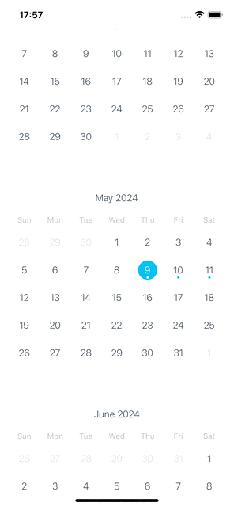

#  📸 React Native Jitsi Meet


<p align="center">
  
</p>

## Instalação das dependências

```bash
yarn
```

## Execução

### Pre-build (Compilação do código) iOS

```bash
yarn ios
```

### Pre-build (Compilação do código) Android

```bash
yarn android
```

### Execução do projeto

```bash
yarn start
```

## Teste

Entre no site: `https://meet.jit.si/` e crie uma sala.
Vá no arquivo  `Meeting.tsx` e altere a variável `room` para o nome da sala criada.
